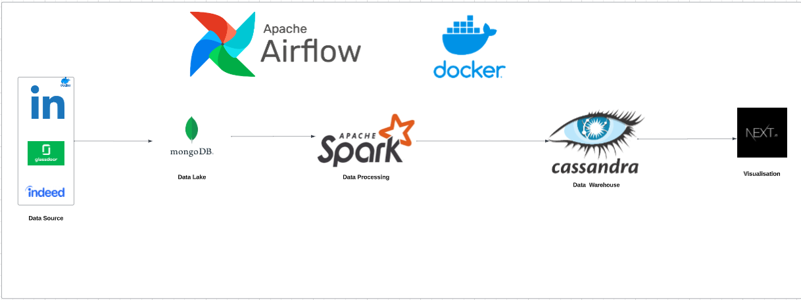

# Job Offers Aggregator and Visualization



## Overview

This data engineering project aims to collect job offers data from LinkedIn, Glassdoor, and Indeed using Python Selenium.
The collected data is stored in MongoDB as a data lake and then processed using PySpark.
The processed data is stored in Cassandra as a data warehouse. Additionally, a Next.js web application with a Google Map is provided to display job offers on the map with their details and links.
The entire project is fully Dockerized with Docker Compose and orchestrated using Apache Airflow.

### Key Features

- Automated data collection from LinkedIn, Glassdoor, and Indeed.
- Storage of raw data in MongoDB as a data lake.
- Data processing with PySpark.
- Storage of processed data in Cassandra as a data warehouse.
- A Next.js web application for visualizing job offers on Google Maps.
- Dockerized project components for easy deployment.
- Apache Airflow for orchestration and scheduling.

## Table of Contents

- [Installation](#installation)
- [Data Collection](#data-collection)
- [Data Processing](#data-processing)
- [Web Application](#web-application)
- [Orchestration with Apache Airflow](#orchestration-with-apache-airflow)
- [Contributing](#contributing)


## Installation

To get started with this project, follow these steps:

1. **Clone the repository:**

   ```bash
   git clone https://github.com/your-username/Job-Offers-Aggregator.git
   
## Data Collection

The project automates the collection of job offers data from LinkedIn, Glassdoor, and Indeed using Python Selenium. It periodically fetches the latest job offers and stores them in MongoDB as a data lake.

## Data Processing

The collected data is processed using PySpark to clean, transform, and enrich the dataset. The processed data is then stored in Cassandra as a data warehouse for efficient querying.

## Web Application

A Next.js web application is provided to visualize job offers on a Google Map. The application displays job offers' locations and details, along with links to the job postings.

## Orchestration with Apache Airflow

Apache Airflow is used for orchestrating the data collection, processing, and web application tasks. You can define and schedule workflows using Airflow's DAGs.

## Contributing

We welcome contributions to this project! If you'd like to contribute, please follow these guidelines:

- Fork the repository.
- Create a new branch for your feature or bug fix: `git checkout -b feature-name`.
- Make your changes and commit them: `git commit -m "Description of your changes"`.
- Push your changes to your fork: `git push origin feature-name`.
- Submit a pull request to the main repository.


